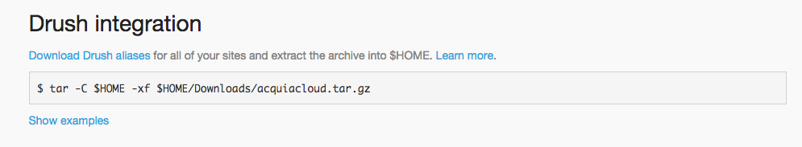

# Hathway Drupal Imlementation Guide
This document outlines Hathway's requirements, guidelines, and best practices for Drupal site development. All engineers, both Hathway employees and sub-contractors, are required to read this guide and agree to all terms outlined here before working on a Hathway Drupal site.

The repository for this

## Consider these questions before starting

### 1. LESS IS MORE
Start with a fresh installation of drupal and carefully consider whether you actually need all of the features of a contributed module before installing it (be aware of what you can do with just drupal core). This applies to theming as well. Do you really need all of the items included in the zurb foundation or bootstrap themes? Chances are you will probably be customizing most of the theme yourself, so it might be better to create your own custom theme and only include the parts of the framework that you need (grid, typography, icons..etc).

### 2 .EDITING CONTENT
This is key -- remember you are building your site within a CMS which most likely means that someone other than you will be attempting to edit and add content. The experience for editing the site should be intuitive and simple if at all possible. If you can’t easily figure out how to edit a piece of content on the site, then chances are the client won’t be able to either.

### 3. IF YOU DON’T NEED IT, DELETE IT
As you get towards the end of a project there may be many items that accumulate over time that can be safely removed. Drupal’s bootstrapping process is heavy enough as it is. Having a lot of unused Modules/Views/Blocks adds to that time even if they are disabled. Delete whatever you can (this includes unused DB tables for fields and modules), but remember to backup your site and do some stability testing before you deploy.

---

## ACQUIA Specific Tips

### Varnish

Make sure your site works with acquia’s varnish implementation. If you have a lot of user interaction you may want to reduce your caching times.

### Insight

Don’t ignore your insight score, there are many helpful security, performance and best practice items analyzed by insight which should be reviewed and addressed.

### Drush aliases

[https://www.deeson.co.uk/labs/drupal-drush-aliases-and-how-use-them](https://www.deeson.co.uk/labs/drupal-drush-aliases-and-how-use-them)

Use drush to sync databases, files, clear caches directly on any acquia remote environment. To download your drush aliases from acquia: Login to your acquia cloud account -> Go to your profile page -> Click on the "Credentials" link -> Click on the Download Drush Aliases link to download the relevant files.

## HATHWAY commonly used modules

1. **Try and avoid beta modules if possible**
2. **Do not use alpha modules on client sites**

### Features (REQUIRED for all sites)

[https://www.drupal.org/project/features](https://www.drupal.org/project/features)

* Use this module to track any frequently updated drupal configuration items. All configuration updates should be exported, and tracked via version control and then deployed to various environments.
* Features should be setup and used on all new hathway Drupal 7 sites. When setting up a feature it should be named in accordance with what configuration will be tracked by the feature, including the client code in the machine name (tibco_webforms).
* Feel free to use each module that is created by FEATURES for custom code implementation as it relates to the created feature

### Panels

[https://www.drupal.org/project/panels](https://www.drupal.org/project/panels)

* A great module for implementing page layouts across multiple pages. Custom panel TPL’s can be created and used throughout any page on the site. Use panel variants to create pages that use separate layouts depending on specific selection rules you create. For instance different layouts can be used on a wiki page or a landing page by setting a selection rule to detect the content type of the page being viewed. Most contributed modules easily integrate with panels, and panel panes can be added to any layout which includes views, custom blocks, forms…etc.

### Backup & Migrate (REQUIRED for non acquia sites)

[https://www.drupal.org/project/backup_migrate](https://www.drupal.org/project/backup_migrate)

* If your hosting service does not provide scheduled backups, then this module is a must have.
* ALL environments must have a scheduled backup at least once per day, with a limit of how many backups to keep depending on disk allocation. Hathway recommends at least 10 backups be kept for each environment at any given moment.
* Not currently supported by acquia cloud. Acquia cloud has its own implementation of auto and manual backups which are implemented by default

### Advanced CSS/JS Aggregation

[https://www.drupal.org/project/advagg](https://www.drupal.org/project/advagg)

* If you have a lot of CSS or JS files this module does a great job with grouping and aggregating those files. It will also fix any IE related aggregation issues (IE has an include limit).

### SOLR

[https://www.drupal.org/project/apachesolr](https://www.drupal.org/project/apachesolr)

* If you are building a site with a lot of content (thousands of pages), apache SOLR is probably your best option for searching content quickly. SOLR provides and interacts with it’s own independently setup DB environment and has wide support within the Drupal 7 community for many features including multilingual indexing and predictive results.
* Custom filtering can be exposed using the SOLR Facet api

### Devel

[https://www.drupal.org/project/devel](https://www.drupal.org/project/devel)

* Devel is a must have feature for developers on DEVELOPMENT/LOCAL environments. This module will help you debug and find anything from php field variables to finding the right TPL to use for overriding a view or block.

### Elysia Cron

[https://www.drupal.org/project/elysia_cron](https://www.drupal.org/project/elysia_cron)

* A great module for creating custom cron schedules for any cron that a module provides.
* Not currently supported by acquia cloud. Acquia cloud contains its own cron setup outlined below:  
_**NOTE:** You should use the Cloud > Cron page for scheduled jobs, rather than the default Drupal 7 cron or any of the contributed Cron modules, such as Elysia Cron or Ultimate Cron. Compared to other Cron solutions, using the Cloud > Cron page is more reliable and provides extensive and integrated logging for Acquia Cloud websites. The default Drupal 7 cron (poor man's cron) is enabled by default and you should disable it, setting the run time to Never. You can do this on your Drupal website's /admin/config/system/cron page. The default Drupal 7 cron is triggered by website activity, so relying on Acquia Cloud ensures that cron jobs are run on the schedule you specify, and not just when the website is visited. This both improves reliability and avoids the performance reduction on page requests._

### Location

[https://www.drupal.org/project/location](https://www.drupal.org/project/location)

* If you need to display mapped locations then the location module is a great solution. If you need more robust integration with other modules like panels, you may want to also look into the OpenLayers module which is more robust.

### CDN

[https://www.drupal.org/project/cdn](https://www.drupal.org/project/cdn)

* This module is useful if you plan on serving your files through a CDN.

### Flag

[https://www.drupal.org/project/flag](https://www.drupal.org/project/flag)

* The flag module can be used for many different purposes, and integrates well with other modules such as RULES. This module allows you mark an entity as flagged or unflagged, and can be used for a variety of reasons such as subscribing an author to a specific piece of content.

### Rules

[https://www.drupal.org/project/rules](https://www.drupal.org/project/rules)

* A powerful module for implementing event based actions. For instance when a user edits a piece of content an email can be sent out to the site Administrator. Integrates will several modules.

### Module Filter

[https://www.drupal.org/project/module_filter](https://www.drupal.org/project/module_filter)

* This is an admin module that simply makes it easier to see what modules are installed and provides a filterable list. Also has some small but nice features like displaying the specific module version that you have installed directly in the UI.

### Quicktabs

[https://www.drupal.org/project/quicktabs](https://www.drupal.org/project/quicktabs)

* The main purpose of this module is to provide a set of tabs to switch content. What makes it useful is that these tabs can contain anything from Custom blocks, Views, forms, and custom callbacks. Tabbed content can all be loaded at once, or one by one with ajax to decrease server load on initial page load. Integrates well with panels and many other modules.

### Transliteration

[https://www.drupal.org/project/transliteration](https://www.drupal.org/project/transliteration)

* Prevents various php related issues with special characters in filenames by sanitizing files on upload.

## Unapproved Modules

Use of these modules requires EXPLICIT permission from HATHWAY engineering, and you must be able to demonstrate exactly why you need the functionality from any of these modules along with alternatives you have tried unsuccessfully.

### Views PHP

* Any module that provides a php input is potentially dangerous and has various security implications.

### PHP Filter

* Any module that provides a php input is potentially dangerous and has various security implications.

### Display Suite

* This is a widely used module, and can be used if needed for specific use cases where sharing customizable displays across large parts of the site is needed.

### Context

* Another widely used module that can be used if absolutely needed, however most of the time custom block implementation can be used to display appropriate content based on context.

### Bean

* Haven’t found anything that this module can do that a custom block cannot.

### EVA: Entity Views Attachment

* I haven’t found a single use case for this module yet. Chances are you can get the functionality you want with less overhead using another method.

## Deployments

* Code Deployments should be handled through version control (git) using feature branches.
* Configuration deployments should be handled through the FEATURES module
* Content Deployments can happen in a variety of ways depending on your team workflow. Usually this is done with manual input, but modules like node export can be used as well.

## DRUSH Integration

* Drush is highly recommended for any Drupal installation you are working with and provides a vast array of command line tools for use with Drupal. While this isn’t required it will make interacting with various Drupal installations (especially Acquia sites) much easier.
* Installation instructions:
	* [Drush installation with BREW](https://www.drupal.org/node/954766)
	* [Drush with MAMP](http://bramvandenbulcke.be/en/article/installing-drush-mamp)

## Drupal Coding Standards & Integration

* Custom modules, theming functions, CSS and Javascript should adhere to Drupal coding standards defined here:
[https://www.drupal.org/coding-standards](https://www.drupal.org/coding-standards)
* You can install the Coder module (localhost only) to review your custom code and it will help identify syntax and security related issues.
[https://www.drupal.org/project/coder](https://www.drupal.org/project/coder)
* Custom code should be packaged up into separate modules if possible and placed in a folder named "custom" in `/sites/all/modules`. For instance if you have a module that handles a lot of small custom functionality try and use a useful name (`sitename_utilities`) and place all of the JS and CSS that apply to that module within it. You can also place custom code in specific FEATURES modules, but be sure to separate your features accordingly so that they are easier to maintain (e.g. Separate features for: content types config, taxonomy config, permissions, rules..etc)

Theme specific customizations should be packaged with the related theme in `/sites/all/themes/custom_theme`.

## Custom Code Implementation

* There will be many instances where the default Drupal or module configuration will not give you the exact output, markup or result that you are looking for. Fortunately Drupal has an extremely powerful HOOK system for handling these scenarios.

### Example 1
This example shows how to implement a custom taxonomy term link to a SOLR Search facet link. Normally taxonomy term links are generated as "[http://sitename/taxonomy/term/termid](http://sitename/taxonomy/term/termid)" which isn’t the link we want. This particular example shows a way to customize this link specific to a panel pane using a preprocess hook provided by the panels module.

    /**
    * Implements hook_preprocess_panels_pane().
    */
    function tibco_answers_content_types_preprocess_panels_pane(&$vars) {
      //Preprocess product group tags to link to the correct
      //search facet url
      if($vars['pane']->subtype == 'node:field_product_group'){
        if (arg(1) && is_numeric(arg(1))) {
          $node = node_load(arg(1));
          if ($node && isset($node->type) && $node->type == 'answers_question') {
            if(!empty($vars['content']['#object']->field_product_group[LANGUAGE_NONE])) {
              foreach($vars['content']['#object']->field_product_group[LANGUAGE_NONE] as $search_link) {
                $search_link['taxonomy_term']->search_link = '/answers/product_group/' . $search_link['taxonomy_term']->tid;
              }
            }
          }
        }
      }
    }

### Example 2
In this example we want to get a count of a particular node type related to another content type and print the result in a custom block that we can place in a region or panels pane. We use the proper hooks for registering a new block with Drupal [`hook_block_info()`, and `hook_block_view()`], and then we use our custom callback to generate the output that we want (in this case a count of how many answers exist on a related question).

    /**
     * Implements hook_block_info()
     */
    function tibco_utilities_block_info() {
      $blocks['answers_count'] = array(
      // The name that will appear in the block list.
      'info' => t('TIBCO Utilities: Answers count with heading'),
      // Default setting.
      'cache' => DRUPAL_CACHE_PER_ROLE,
      );
      return $blocks;
    }

    /**
     * Configures permissions for TIBCO Utilities blocks
     */
    function tibco_utilities_block_view($delta = '') {
        $block = array();
        if (!user_access('access content'))
            return $block;
        switch ($delta) {
          case 'answers_count':
              $block['content'] = tibco_utilities_answers_count();
              break;
        }
        return $block;
    }

    function tibco_utilities_answers_count() {
      $node = menu_get_object();
      $nid = $node->nid;
      //Get answer row count by nid
      $query_count = db_select('field_data_answers_related_question', 'f')
                ->fields('f', array('answers_related_question_target_id'))
                ->condition('answers_related_question_target_id', $nid, '=')
                ->execute()
                ->rowCount();

      //Plural and singular detection
      if($query_count > 0 && $query_count == 1) {
        $output_text = t('Answer');
      }
      else {
        $output_text = t('Answers');
      }

      //Output markup with count
      if($query_count == 0) {
        $output = '';
      }
      else {
        $output = '<h3 class="pane-title">(' . $query_count . ') ' . $output_text . '</h3>';
      }
      return $output;
    }
